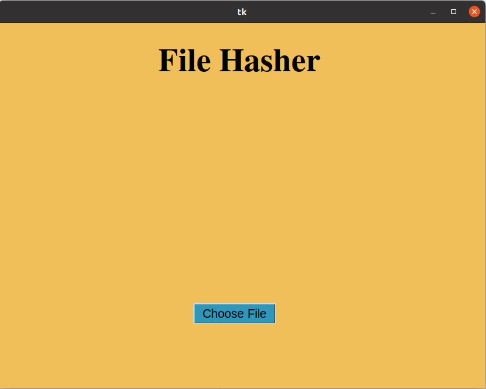
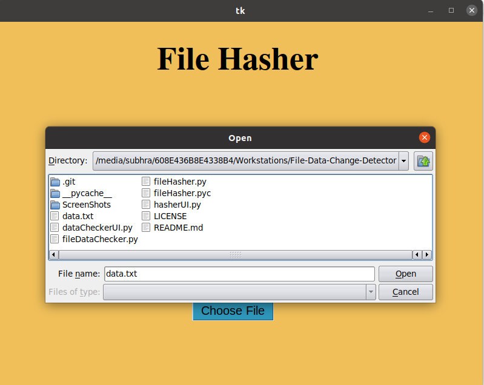
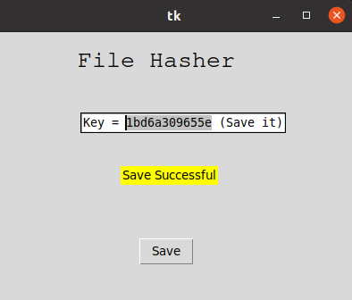
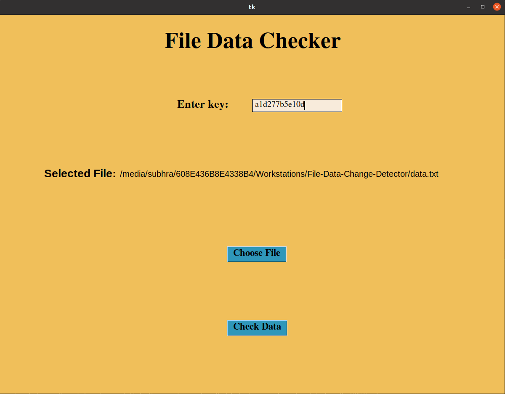
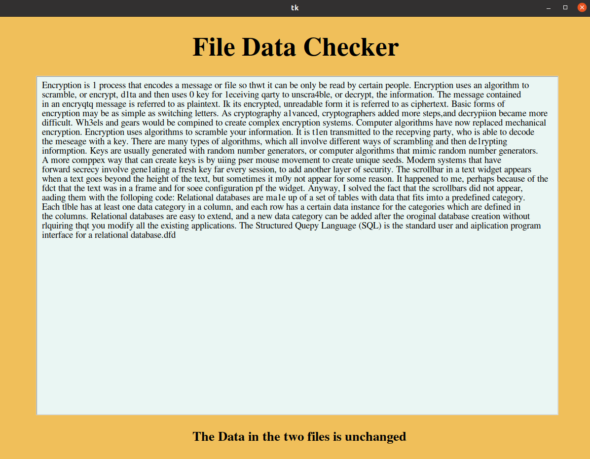

# Executing File Hasher
```
python3 hasherUI.py
```
choose the file &rarr; save the key &rarr; click the save button

## Screen 1


## Screen 2


## Screen 3


## Screen 4: Key saved in email


# Executing Data Checker

```
python3 dataCheckerUI.py
```
enter the key &rarr; choose the file &rarr; click check data

## Screen 1


## Screen 2: No data changed


## Screen 3: Data changed

